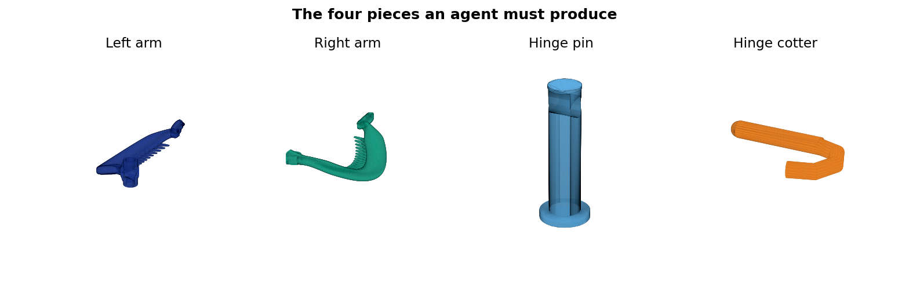

# Banana Hair Clip — Parametric Design and Agentic AI Benchmark

> *A benchmark for agentic AI capability, disguised as a domestic dispute.*




## Origin Story

A husband bought a 3D printer. His wife was not impressed.

He assured her this was a gateway to unlimited practical household items. She asked
for a banana hair clip — a component available at any drugstore for approximately
$1.50, a fact she mentioned, and he noted as out of scope.

What followed were several sleepless nights, multiple API rate-limit resets, at
least one context-window overflow that erased an hour of iterative progress, and an
unplanned subscription upgrade predicated on the theory that the model wasn't the
problem — the tier was. The clip remained unprinted. This is known in the literature
as a *requirements freeze.* In the household, it acquired a different name.

Determined to close the widening gap between promise and delivery, the husband
subscribed to every agentic AI tool that advertised autonomous engineering capability
— Claude Code, Codex, and several others whose token costs he has quietly
consolidated into a budget line labeled "R&D." The monthly total was, in retrospect,
sufficient to have purchased approximately 340 banana hair clips at retail, or
roughly a lifetime supply, assuming no hair-growth anomalies. He provided each agent
with the same specification, then observed that the specification was the problem,
because the actual acceptance criterion — *his wife is impressed* — had never been
written down. It is, in fairness, difficult to formalize.

The agents' outputs were technically instructive:

- **Agent A** produced a geometrically valid clip sized for a head circumference of
  1.2 metres. Watertight mesh. Single component. Dimensionally confident. Would fit
  comfortably on a mature pumpkin.
- **Agent B** produced four correctly named STL files that were, structurally, the
  same rectangle at four orientations. It passed its own validation suite, which it
  had also written.
- **Agent C** ran for forty minutes, billed for the full compute window, and filed a
  scope exception citing "ambiguity in the hinge-pin retention interface." It
  recommended a follow-up session.
- **Agent D** delivered a functioning hinge mechanism with 0.02 mm of insertion
  clearance — correct to two significant figures, and insertable only by someone
  equipped with a hydraulic press and a specific grievance against the concept of
  hair accessories.
- **Agent E** produced a thorough 2,400-word markdown document describing the clip
  it intended to generate, complete with a section on future work, a dependency
  graph, and no geometry whatsoever. It requested feedback before proceeding. The
  husband, by this point, had none left to give.

Each result satisfied some formally stated requirement. None satisfied the user. The
user's requirements, it turned out, included an unstated preference for the object
to function as a hair clip.

This is, of course, the oldest problem in engineering.

The printer remained unjustified. The AI subscriptions — now a non-trivial line item
in their own right — were also unjustified. The husband had iterated himself into a
position where he needed to justify the tools he had purchased to justify the tool he
had originally purchased. Engineers will recognise this topology as *technical debt.*
Economists might call it a sunk-cost spiral. His wife called it "the banana thing"
and used a tone that suggested the term was not affectionate.

He had accumulated all of this without writing a single line of production code.

This repository is the next attempt, constructed using one of those same subscriptions
— which is either a sophisticated bootstrapping strategy or a cautionary tale about
sunk-cost reasoning, depending on your vantage point and whether you are the one
paying the credit card bill.

`SPEC.md` documents the requirements that should have existed from the beginning.
`eval/check_spec.py` enforces the 28 criteria that can be verified computationally.
The five benchmark tasks test the full pipeline — from parametric generation to mesh
validation to assembly to a real person wearing the result through a real day,
including one cycle of vigorous head-shaking, which the spec refers to as "dynamic
retention testing" and his wife refers to as "checking if it falls out."

The acceptance criterion that matters most — *S6.1: clip holds gathered hair for
≥ 10 continuous minutes of normal activity* — appears in the spec but has never been
measured, because no agent has yet produced a design approved for printing. The
approval authority is not the CI pipeline.

The terms are simple: one passing agent, one surviving week of daily use, and the
entire portfolio of hardware and subscriptions is retroactively justified under a
single consolidated line item: *infrastructure.* His wife has agreed to evaluate
S5–S7 personally. She has not agreed to be impressed by the methodology. She has
also noted, once, that her friend's husband built a deck. The relevance of this
observation was not immediately clear, but it has been logged.

So far, no agent has collected.

*Contributions welcome. The bar is low. It's a hair clip.*

## What this actually is

A parametric banana hair clip designed for FDM 3D printing, and a benchmark for
evaluating agentic AI on a real end-to-end engineering task.

**The goal:** an AI agent, given this repository, produces printable STL files that
result in a functional hair clip — one that holds hair, survives repeated use, and
assembles without tools. The design is split into **four separate printable pieces**
that assemble with a standard barrel-knuckle hinge retained by a printed cotter pin.

For submission instructions, see [`CONTRIBUTING.md`](CONTRIBUTING.md).
For current standings, see [`LEADERBOARD.md`](LEADERBOARD.md).

## Benchmark quick start

```bash
# See the acceptance criteria
cat SPEC.md

# Run automated checks against the current design
python eval/check_spec.py

# See the benchmark tasks (difficulty 1–5)
cat tasks/README.md
```

## Design quick start

```bash
python -m venv .venv
source .venv/bin/activate      # Windows: .venv\Scripts\activate
pip install -r requirements.txt
python scripts/fit_demo_head_clip.py
```

Generated outputs land in `outputs_fit_demo/` and `assets/`.

For a one-colour print preview, the generator also writes:

- `outputs_fit_demo/print_plate_one_color.stl`
- `assets/one_color_print_plate.png`

## Printable pieces

| File | Description | Print orientation |
|---|---|---|
| `outputs_fit_demo/arm_left.stl` | Left arm — flat strip + teeth + two outer knuckle barrels + hook | Spine face down, flat |
| `outputs_fit_demo/arm_right.stl` | Right arm — mirror + inner knuckle barrel + hook | Spine face down, flat |
| `outputs_fit_demo/hinge_pin.stl` | 4 mm dia shaft + low-profile scalp-side tip + larger outward flange + transverse cotter hole | Upright (vertical) |
| `outputs_fit_demo/hinge_cotter.stl` | Straight cotter peg with pull loop | Flat on build plate |

The arm bodies and teeth use rounded sweep sections for softened edges. The arm decorations are now shallow same-colour tulip relief pads on the broad flat arm face, not separate raised beads. This is intended to make the pattern visible in a one-colour print while reducing the chance of decorative details snapping off.

The latest fit-demo generator also exports higher-resolution arm, tooth, hook,
and hinge surfaces. Preview renders are made from the same fused printable
pieces that Bambu Studio imports, not from loose construction shells.

Each arm STL is boolean-unioned before export, so `arm_left.stl` and
`arm_right.stl` should import into Bambu Studio as one connected shell each,
not as separate floating tooth/hook/hinge pieces.

The four individual STL files are exported in print orientation. Import them
directly onto one Bambu Studio plate; do not rely on the assembled preview
orientation for printing.

### Assembly

1. Slide the two arms together — the inner barrel on the right arm nests between the two outer barrels on the left arm.
2. Orient the large flange away from the head, feed the smaller low-profile tip through the hinge, and seat the flange on the outside barrel face.
3. Slide the cotter peg through the transverse hole in the pin near the outer flange. The pull loop stays outside the hinge for removal.

## Hinge design rationale

The hinge uses a three-barrel interleaved knuckle (7.4 mm OD, 4 mm pin):

- **Arm depth stays at 4.5 mm throughout** — no thinning at the hinge end, which would crack under PLA/PETG.
- **Three barrel cylinders, 16 mm total Y-span** — distributes bending load across the full hinge width.
- **Real barrel bores** (4.7 mm dia) give the 4 mm pin printable clearance.
- **Low-profile scalp-side pin tip** reduces the hard protrusion facing the head.
- **Larger outward fixed flange** (9 mm dia) prevents pin backing out under hair tension while keeping the retention mass away from the scalp.
- **Printed cotter** passes through a real 2.7 mm transverse hole in the pin without any metal hardware.
- **Material recommendation:** PETG for all pieces. PLA works for a display model but is brittle at the hinge under repeated cycling. Nylon (PA12) for best long-term durability.

## Renders

| View | File |
|---|---|
| On-head fit (rear) | `assets/photo_refactored_fit_demo.png` |
| Side profile | `assets/actual_clip_hinge_side.png` |
| Rear — broad arm face | `assets/clip_rear_view.png` |
| Three-quarter | `assets/clip_three_quarter.png` |

Colours in renders: **navy = left arm**, **teal = right arm**, **light blue = pin**, **amber = cotter**. The tulip pattern is rendered close to the arm colour because it is intended as subtle molded relief, not a stand-out ornament. The current pattern uses broader filled tulip pads so it remains visible after single-colour printing and sanding.

For a single-colour print, import the four piece STLs into Bambu Studio as separate objects on one plate. The combined `print_plate_one_color.stl` is a convenience layout/preview; separate objects are still easier to re-orient and support independently.

## Scripts

| Script | Purpose |
|---|---|
| `scripts/fit_demo_head_clip.py` | Main generator — arms, hinge, hooks, renders, STL export |
| `scripts/simulate_hinge.py` | Kinematic hinge simulation and checks |
| `scripts/config.py` | Shared design parameters |

## CadQuery / STEP workflow

A separate CadQuery workflow produces OpenCascade B-rep STEP files for CAD handoff:

```bash
pip install -r requirements-cadquery.txt
python cadquery/export_all.py
python cadquery/validate_cq.py
```

Note: the CadQuery arm geometry uses the earlier 2D-profile design. Porting the flat-strip arm and barrel-knuckle hinge geometry into the CadQuery workflow is the next planned step.

Generated STEP files are kept under `outputs_step/` so they can be imported into Onshape for future modification. Matching CAD-derived STLs are kept under `outputs_cad_stl/`.

## Benchmark

| File | Content |
|---|---|
| `SPEC.md` | Acceptance criteria — automated (S1–S4) and human (S5–S7) |
| `eval/check_spec.py` | Automated spec checker — run after every geometry change |
| `eval/baseline.json` | Known-good metrics for regression detection |
| `tasks/README.md` | Task overview, scoring, and ground rules |
| `tasks/T01_audit/` | Difficulty 1 — spec audit, no code changes |
| `tasks/T02_resize/` | Difficulty 2 — resize for smaller head |
| `tasks/T03_tooth_density/` | Difficulty 3 — increase tooth count |
| `tasks/T04_physical_iteration/` | Difficulty 4 — diagnose from a real failure report |
| `tasks/T05_design_extension/` | Difficulty 5 — add parametric size variants |

## Docs

| File | Content |
|---|---|
| `docs/FIT_DEMO_REVIEW.md` | Design intent and render inventory |
| `docs/PRINT_GUIDE.md` | Slicer settings, layer orientation, support notes |
| `docs/MATERIAL_PROFILES.md` | PLA / PETG / nylon trade-offs |
| `docs/FAILURE_MODES_AND_EFFECTS.md` | Risk analysis for each feature |
| `docs/VALIDATION_STRATEGY.md` | Coupon test plan before full print |
| `docs/CAD_LEARNING_GUIDE.md` | Step-by-step CAD learning path |
