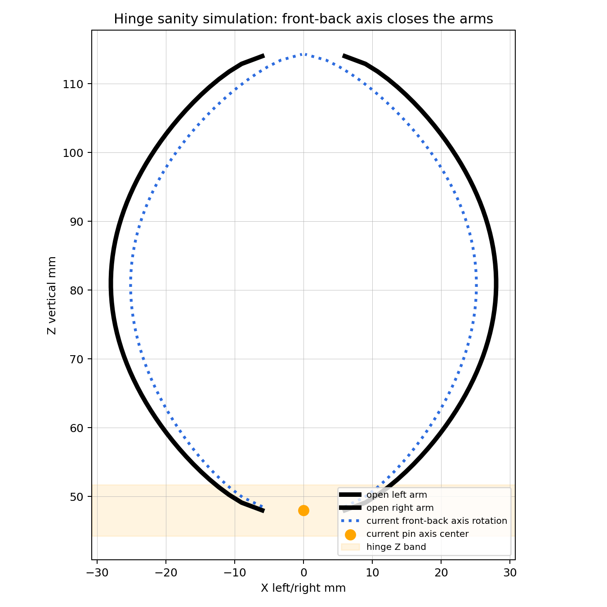

# Hinge Simulation Report

Generated by `python scripts/simulate_hinge.py`.

## Result

PASSED - front-back hinge axis is kinematically plausible.

## Key Measurements

- Current pin axis center: `[0.0, 36.869, 48.0]`
- Visible hinge center: `[0.0, 36.869, 48.0]`
- Pin-to-block Z offset: `0.000 mm`
- Pin inside visible hinge block Z range: `True`
- Interleaved barrel owner pattern: `[-1, 1, -1]`
- Barrel axial clearance min: `0.400 mm`
- Pin-to-barrel radial allowance: `0.350 mm`
- Cotter-to-pin-hole radial allowance: `0.450 mm`
- Hidden pin capture beyond outer barrels: `1.975 mm per side`
- Exposed bolt/pin geometry shown in render: `False`
- Configured conservative stop angle: `34.0 deg`
- Open arm X gap min/mean/max: `12.000 / 42.671 / 55.989 mm`
- After current front-back axis rotation gap min/mean/max: `0.450 / 36.757 / 50.258 mm`
- Current-axis mean gap reduction: `5.915 mm`

## Failures

## Design Implication

The hinge now keeps the pin as hidden functional intent instead of exposed bolt-like hardware. The visible form is interleaved molded barrels with intentional axial gaps and rounded stop nubs near the arm roots. This is still a kinematic sanity check, not a fatigue/contact simulation. The next CAD step is to transfer these dimensions into the CadQuery STEP model as editable hinge leaves with real bores.

